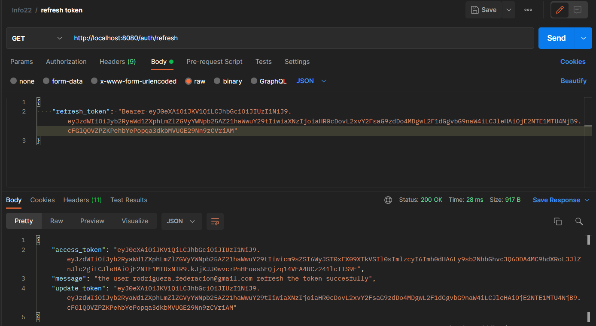

# Java - Spring Boot (Proyecto: API REST) INFORMATORIO 2022 🚀

## Desarrollado por 🖥️  [AndresRodriguez](https://www.linkedin.com/in/andres-rodriguez-60a166208/) - [GitHub](https://github.com/AndrRod) - [PortFolio](https://andresporfolio.herokuapp.com/)

### Objetivo

Proyecto API REST - El objeto es crear un proyecto escalable, donde se utilizan conceptos vinculados java 8, buenas practicas, programación funcional, seguridad y docker. 


### Herramientas utilizadas
- 👉 Java y Spring Boot
- 👉 Las rutas siguen el patrón REST
- 👉 Librería Spring Security
- 👉 Encriptación de contraseñas (PasswordEncoder)
- 👉 Utilización de tokens para validar rol de usuario a fin de que pueda utilizar determinados paths (access_token)  y refresh tokens para actualizar el periodo de vide del token (refresh_token).
- 👉 Manejo de Excepciones (Carpeta exception - excepciones particulares reutilizables - manejo general de excepciones)
- 👉 Manejo de Mensajes de respuestas (Clases reutilizables, properties exclusivos para mensajes, MessageSource)
- 👉 Paginación (Mediante una clase reutilizable llamada PaginationMessage).
- 👉 Utilización de DTOs (creación manual).
- 👉 Soft delete (borrado logico).

---------------------------

### Para ejecutar la API 👇🏻

* Descargar el [Proyecto](https://github.com/AndrRod/Informatorio2022/archive/refs/heads/main.zip) o [Colarlo](https://github.com/AndrRod/Informatorio2022.git) .
* En la consola se dirige a la carpeta del proyecto (```  /Informatorio2022-main ``` ).
* Ejecuta los siguientes comandos: ``` mvn clean install ```  y luego ``` mvn spring-boot:run ``` .
* Pruebe ejecutar los endpoints, siguiendo la documentación de la API detallada a continuación.

## Requerimientos técnicos
## 1. A. Modelado de Base de Datos

**User:** es una ENTITY y contiene:
    
     - id. (autogenerado)
     - firstName.
     - lastName.
     - email.
     - password.
     - role. (role User autogenerado)
     - createDate (fecha creación autogenerada)
     - delete.

**Role:** es un ENUM y contiene los siguientes roles:

    - "ROLE_USER";
    - "ROLE_COLLABORATOR";    
    - "ROLE_OWNER";


---------------------------

## 2. Autenticación de Usuarios
El usuario despues de registrarse y logearse, obteniene un token, el cual es necesario y requerido para acceder a los demás paths, una vez que pasa 30 minutos el token queda desactualizado o vencido, lo que obliga a que el usuario vuelva a generarlo mediante un nuevo login.

### POST (registro)
	http://localhost:8080/auth/register

Ejemplo:

    {
        "firstName": "andres",
        "lastName": "rodriguez",
        "email": "rodrigueza.federacion@gmail.com",
        "password": "12345689"
    }
Ejemplo creación exitosa:
    


Ejemplo error en la creación:


### POST (login)

	http://localhost:8080/auth/login

Ejemplo:

    {   
        "email": "rodrigueza.federacion@gmail.com",
        "password": "12345689"  
    }

Ejemplo login exitoso:


Ejemplo login con error:


### TOKENS
Para acceder a cualquier path que requiera rol ("ROLE_USER" o "ROLE_ADMIN"), una vez logeado, se debe ingresar el token.
El token se encuentra codificado y está compuesto por tres partes como se ve en la imagen:


Acceder a un path con token


Acceder a un path sin token


Token vencido:


Actualización de token:



### POST (actualizar rol de usuario)

	http://localhost:8080/users/role/{id}

Ejemplo:

Path:

    http://localhost:8080/users/role/14

Body:

    {
        "roleName": "USER"
    }
Ejemplo de actualización exitosa de rol:


Ejemplo error actualización de rol:


---------------------------
🎁 Hecho por  [AndresRodriguez](https://www.linkedin.com/in/andres-rodriguez-60a166208/) !!!!
